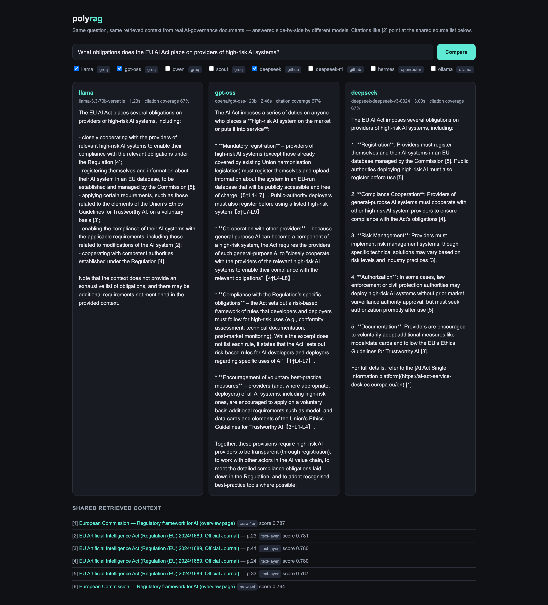

# polyrag — multi-model RAG over real AI-governance documents

**Live demo: [chinmaya301-polyrag.hf.space](https://chinmaya301-polyrag.hf.space)**
(free Hugging Face Space; may take a moment to wake if idle)

**Related RAG case study:** [Financial Balance-Sheet RAG: Building Citation-Grounded Document Intelligence](https://app.chinmayarora.com/blog/financial-balance-sheet-rag/)

Ask a question about AI governance and get **side-by-side, citation-grounded answers
from multiple LLMs** — same question, same retrieved context, so differences in the
answers are attributable to the model, not to retrieval variance.

The corpus is real, public policy documents (NIST AI RMF, NIST GenAI Profile,
EU AI Act, Blueprint for an AI Bill of Rights, OECD AI Principles) — no synthetic data.

**The demo can run on free, rate-limited provider tiers**: Groq for GPT-OSS/Qwen,
GitHub Models for DeepSeek/GPT-4.1 mini, optional OpenRouter models, local Ollama,
local embeddings, and exact FAISS search. Provider catalogs and quotas change, so
the registry distinguishes active models from archived historical entries.



## Architecture

```
 sources.yaml (real public docs)
        │
        ▼
 ┌─ Ingestion ─────────────────────────────┐
 │ PDFs: PyMuPDF text layer                │
 │       └─ OCR fallback (RapidOCR) for    │
 │          pages with no text layer       │
 │ Web:  Crawl4AI (HTTP strategy)          │
 │       └─ httpx + trafilatura fallback   │
 │ → data/extracted/*.jsonl  (per-page     │
 │   records tagged with extraction method)│
 └─────────────────────────────────────────┘
        │
        ▼
 ┌─ Indexing ──────────────────────────────┐
 │ paragraph-aware chunking (overlap,      │
 │ full provenance: doc / url / page)      │
 │ sentence-transformers MiniLM embeddings │
 │   device auto-detect: CUDA > MPS > CPU  │
 │ FAISS IndexFlatIP (cosine, exact)       │
 └─────────────────────────────────────────┘
        │
        ▼
 ┌─ Retrieval + Generation ────────────────┐
 │ top-k retrieve once → numbered context  │
 │ fan out in parallel to N models via     │
 │ OpenAI-compatible APIs:                 │
 │   Groq:          GPT-OSS 120B + 20B,    │
 │                  Qwen 3.6 27B           │
 │   GitHub Models: DeepSeek V3 + R1,      │
 │                  GPT-4.1 mini           │
 │   OpenRouter:    Nemotron 3 Super       │
 │   Ollama:        any local model, no key│
 │ answers must cite blocks as [n]         │
 └─────────────────────────────────────────┘
        │
        ▼
  CLI (typer) · FastAPI service + web UI · Docker · Cloud Run
```

## Quickstart

```bash
git clone https://github.com/ChinmayA301/polyrag && cd polyrag
python3.12 -m venv .venv && source .venv/bin/activate
pip install -e ".[embed]"          # + [crawl] for Crawl4AI, [ocr] for RapidOCR, [dev] for tests

cp .env.example .env               # add your free GROQ_API_KEY (console.groq.com)

polyrag ingest                     # download + extract the real corpus (~5 min, cached)
polyrag index                      # chunk + embed + build FAISS index
polyrag models                     # what's ready on this machine

polyrag ask "What are the four core functions of the NIST AI RMF?" -m gpt-oss
polyrag compare "What obligations does the EU AI Act place on providers of high-risk AI systems?" \
    -m gpt-oss -m gpt-oss-20b -m deepseek
polyrag eval -m gpt-oss -m gpt-oss-20b   # retrieval hit@k + generation stats
polyrag serve                      # web UI at http://localhost:8080
```

No API key at all? `-m mock` exercises the full pipeline offline (it's what CI uses),
and `-m ollama` works with a local Ollama install.

## Evaluation

`polyrag eval` runs a hand-labeled eval set ([data/eval.yaml](data/eval.yaml)) against
the index and reports:

- **Retrieval hit@k** — does a chunk from the expected source document appear in the
  top-k results? (No LLM involved; measures the index, not the generator.)
- **Per-model generation stats** — answer rate, mean citation coverage (share of
  retrieved blocks the answer actually cites), mean latency.

> **What these metrics do and don't claim.** Citation coverage measures *grounding
> discipline* — whether the model tied its claims to retrieved text — not factual
> correctness. Retrieval hit@k is measured on 9 hand-written questions; it is a smoke
> test, not a benchmark. Numbers below are from a real run on the real corpus and are
> reproducible with the commands above.

<!-- EVAL RESULTS: updated by running `polyrag eval` — see verification log -->
Results from the latest local run are in [docs/VERIFICATION.md](docs/VERIFICATION.md).

## Honest claims

This repo is a portfolio artifact; the claims it supports are deliberately scoped:

| Claim | Status |
|---|---|
| Multi-model retrieval via OpenAI-compatible APIs (Groq, GitHub Models, OpenRouter, Ollama) | Implemented. Current active mappings are separated from archived model records; the July 2026 live results remain in the verification log as historical evidence. |
| DeepSeek support | Verified live: DeepSeek V3 + R1 via GitHub Models free tier (use a dedicated PAT with `models:read`). Groq and OpenRouter both retired their free DeepSeek offerings — the registry made this a one-line swap |
| FAISS vector search | Exact `IndexFlatIP` over normalized MiniLM embeddings — appropriate at this corpus size; swap to IVF/HNSW only when scale demands it |
| Crawl4AI ingestion | Default web fetcher (HTTP strategy; `js: true` per source enables browser rendering); httpx+trafilatura fallback, and every record is tagged with the path that produced it |
| OCR | RapidOCR fallback for PDF pages with no text layer; pages that need OCR without it installed are disclosed as gaps, never silently dropped |
| CUDA optimization | Embedding device auto-detect (CUDA > Apple MPS > CPU). Developed on Apple Silicon (MPS); the CUDA path is the standard sentence-transformers/torch path but was not benchmarked on an NVIDIA GPU |
| Docker deployment | Live: the demo Space runs this repo's Dockerfile (index baked in, embedding model pre-warmed) on Hugging Face's free Docker hosting via `deploy/hf_space.py` |
| GCP | Cloud Run deploy pipeline (`deploy/cloudrun.sh`, Cloud Build, free-tier sizing) — complete and reviewed, not executed: Cloud Run requires a billing-linked account, and this project deliberately runs card-free |

## Project layout

```
src/polyrag/
  ingest/    pdf.py (PyMuPDF + OCR fallback) · web.py (Crawl4AI + fallback) · pipeline.py
  index/     chunker.py · embedder.py (device auto-detect) · store.py (FAISS + manifest)
  llm/       providers.py (model registry over OpenAI-compatible endpoints)
  rag.py     retrieve → cite-required prompt → answer; parallel multi-model compare
  evals.py   retrieval hit@k + generation stats
  api.py     FastAPI: /ask /compare /models /healthz + web UI
  cli.py     typer CLI
data/        sources.yaml (real docs) · eval.yaml (labeled questions)
deploy/      cloudrun.sh (Cloud Build → Cloud Run)
```

## Deployment

```bash
# Local container
docker compose up --build              # http://localhost:8080

# Hugging Face Space (free, no card; what the live demo runs)
HF_TOKEN=... GROQ_API_KEY=... GITHUB_TOKEN=... python deploy/hf_space.py

# Cloud Run (needs a billing-linked GCP project; builds remotely with Cloud Build)
export GROQ_API_KEY=...
./deploy/cloudrun.sh <PROJECT_ID> [region]
```

The image bakes in the FAISS index and pre-downloads the embedding model, so cold
starts don't fetch anything. The hosted demo exposes only active models whose provider
credentials are configured. Keys live in platform secrets, never in the image or git
history. Use a dedicated GitHub PAT with only `models:read` for `GITHUB_TOKEN`.

## License

MIT
